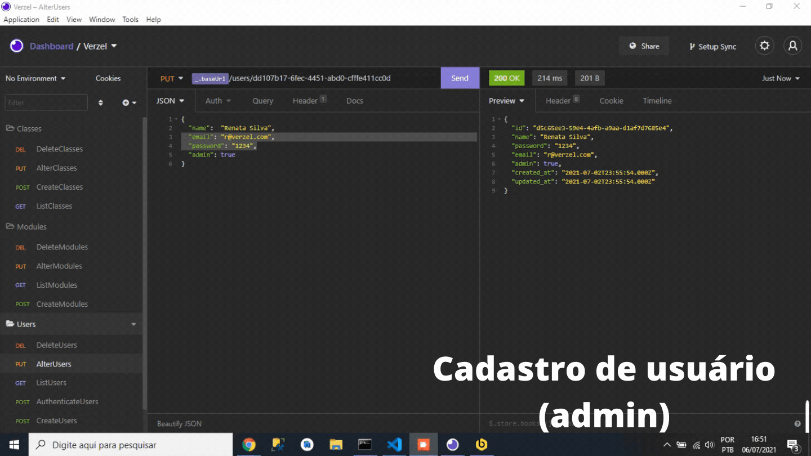

Sistema que visa cadastrar usuários comuns e usuários administrativos, módulos e cursos. 
 
Os cursos possuem chave como chave estrageira os usuários e módulos.
 
Apenas usuários autenticados conseguem visualizar as listas de cursos;
 
Apenas usuários autenticados e administrativo conseguem cadastrar módulos e salas as listas de cursos;
 

Sistema desenvolvido usando: 
<ul>
  <li> NodeJs </li>
   <li> Autenticação JWT</li>
</ul>

  

